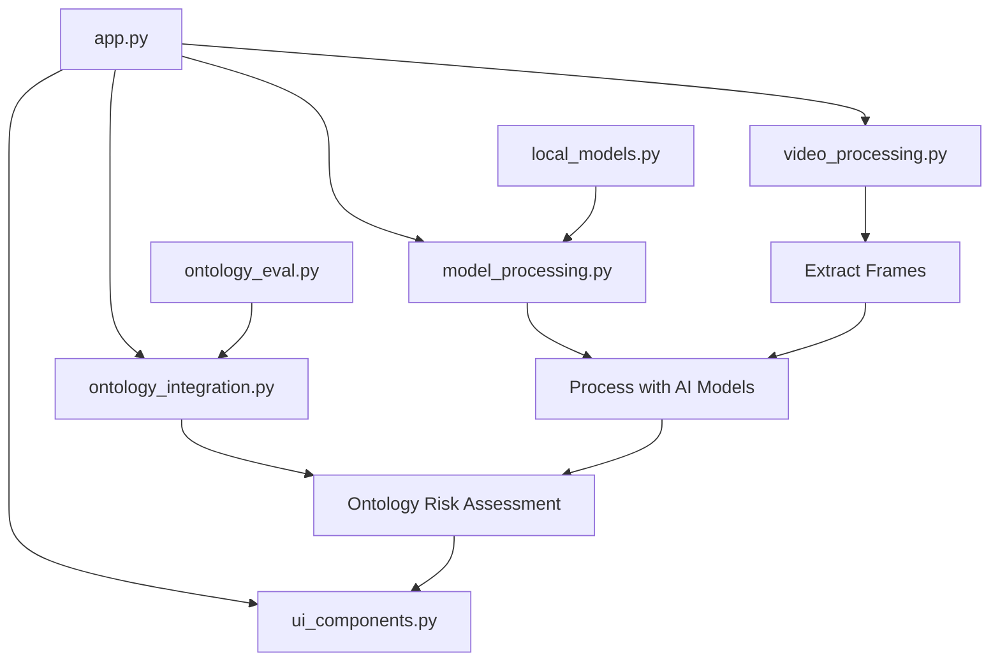

# 📁 Refactored Code Structure

The application has been refactored into modular components for better maintainability and understanding.

## 🗂️ File Structure

```
📦 Bahngleiserfassung/
├── 🎯 app.py                       # Main Streamlit application (refactored)
├── 📹 video_processing.py          # Video frame extraction and repair utilities
├── 🧠 ontology_integration.py      # Ontology-based scene analysis and risk assessment
├── 🤖 model_processing.py          # Local and remote AI model processing
├── 🖥️ ui_components.py             # Streamlit UI components and rendering
├── 🧮 ontology_eval.py             # Core ontology evaluation logic (unchanged)
├── 🔬 local_models.py              # Local AI models (ViT, BLIP) (unchanged)
└── 💾 app_original_backup.py       # Backup of original monolithic app.py
```

## 📋 Module Responsibilities

### 🎯 `app.py` - Main Application
- **Purpose**: Main entry point and orchestration
- **Functions**:
  - Application initialization and layout
  - Model setup and configuration
  - Main processing workflow coordination
  - Input validation and error handling

### 📹 `video_processing.py` - Video Processing
- **Purpose**: Video frame extraction and repair
- **Functions**:
  - `extract_frames_from_video()` - Extract frames at specified FPS
  - `repair_video_with_ffmpeg()` - Repair corrupted video files
  - Handle various video formats (MP4, AVI, MOV, MKV)

### 🧠 `ontology_integration.py` - Ontology Analysis
- **Purpose**: Scene analysis using ontology-based risk assessment
- **Functions**:
  - `analyze_scene_with_ontology()` - Main ontology analysis function
  - `_extract_ontology_features()` - Extract features from scene descriptions
  - `_calculate_person_on_track_confidence()` - Calculate specific risk confidence
  - `extract_scene_description()` - Extract text from model results

### 🤖 `model_processing.py` - Model Processing
- **Purpose**: Handle local and remote AI model processing
- **Functions**:
  - `process_image_locally()` - Process images using local models
  - `query_huggingface_api()` - Process images using remote HF API
  - `process_frame()` - Unified frame processing interface
  - `image_to_base64()` - Image conversion utilities

### 🖥️ `ui_components.py` - UI Components
- **Purpose**: Streamlit UI components and rendering
- **Functions**:
  - `render_sidebar_config()` - Configuration sidebar
  - `render_input_section()` - Video upload interface
  - `render_frame_result()` - Display frame analysis results
  - `render_validation_errors()` - Show validation messages
  - Various helper rendering functions

## 🔄 Data Flow



## ✨ Benefits of Refactoring

1. **🧩 Modularity**: Each module has a single responsibility
2. **🔧 Maintainability**: Easier to update and debug individual components  
3. **📚 Readability**: Clear separation of concerns and smaller, focused files
4. **🧪 Testability**: Each module can be tested independently
5. **🔄 Reusability**: Components can be reused in other projects
6. **👥 Collaboration**: Multiple developers can work on different modules

## 🚀 Usage

The refactored application works exactly the same as before:

```bash
streamlit run app.py
```

All functionality remains identical:
- ✅ NONE / 🟢 LOW / 🟠 MEDIUM / ⚠️ HIGH / 🚨 CRITICAL classification
- Toggle ontology analysis on/off
- Support for local and remote AI models
- Video processing with automatic repair

## 🔒 Backwards Compatibility

- Original functionality is preserved
- API and interface remain unchanged
- Configuration and settings work the same way
- The original monolithic code is backed up as `app_original_backup.py`